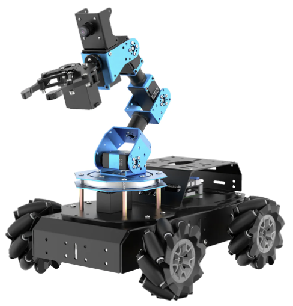

# KAIST EE405A 2024 Spring Semester
## Topic: AI-enabled autonomous rover

In this class, students are invited to build an AI-enabled autonomous rover, based on a ground vehicle platform with GPU-powered computers. Students will learn the basics of robotics including computer vision, navigation, control as well as latest deep learning based detection and decision making. Students will do individual simulation based homework and then build an autonomous rover as a team effort. After building the robot system, students are invited write software that drives the system using latest AI technologies to perform autonomous exploration just like a real life planetary rovers looking for the evidence of life in other planets. 

# Hardware platform

  

 Hiwonder ArmPi Pro 

[Link](https://www.hiwonder.com/collections/robotic-car/products/armpi-pro?variant=40308380958807)  
- 4 omni-directional mecanum wheels
- 6DOF arm (5DOF+gripper)
- FPV camera at the end-effector

  

 Intel Realsense D435 

[Link](https://www.intelrealsense.com/depth-camera-d435/)  

  

 NVIDIA® Jetson Orin™ Nano Developer Kit 

[Link](https://developer.nvidia.com/embedded/learn/get-started-jetson-orin-nano-devkit)  

# Environments
- Ubuntu 20.04
- ROS Noetic

***

# Experiment schedule

 Week 1 - Class Introduction 

 Week 2 - Introduction to Ubuntu & ROS 

<!-- [Lecture Note](Week2/Materials/)   -->
- Instructions for installing Ubuntu (Linux-based OS)
- Understanding the Robotics Operating System (ROS)
- Installation & initial setup for ROS
- Basic ROS examples
- Hands-on learn of ROS programming

 Week 3 - Simulating Robot in Virtual Environment <mark style='background-color: #fff5b1'> (HW: Example on ROS and simulation) </mark> 

<!-- [Lecture Note](Week 3/Materials/)   -->
- ROS Gazebo
- Robot model and environment
  - URDF: Unified Robot Description Format
  - World
- Spawn your own URDF robot in the World
- Virtual Sensors in Gazebo

  

 Week 4 - Overall System Architecture 

<!-- [Lecture Note](Week 4/Materials/)   -->
- Autonomous system configuration
- Modules
    - Control
    - Localization
    - Perception
    - Path planning
    - Task planning

 Week 5 - Vehicle Control 

<!-- [Lecture Note](Week 5/Materials/)   -->
- Learn how to design the Mecanum Wheels Robot
    - Mechanism of Mecanum Wheels Robot
    - Kinematics of Mecanum Wheels Robot
    - Kinematics of 6-DOF robot arm
    - How to operate Hiwonder ArmPi Pro centering on ROS

 Week 6 - Robot Configuration 

<!-- [Lecture Note](Week 6/Materials/)   -->
- Hardware introduction
- Component description
- Before assembling hardware
- Basic soldering tips

 Week 7 - Visual SLAM 

<!-- [Lecture Note](Week 7/Materials/)   -->
- TFs in mobile manipulator
  - Robot TFs
  - TFs for perception
  - TFs for localization
- SLAM
  - ORB-SLAM
- Waypoints for global path planning

  ( Week 8 - Midterm exam week )

 Week 9 - Perception 

<!-- [Lecture Note](Week 9/Materials/)   -->
- Depth Image and Pointcloud
    - Depth estimation using vision
    - Stereo vision
    - Other methods
    - Object detection
    - Point cloud segmentation
- Image
    - Object detection
    - Image segmentation
    - IPM (Inverse Perspective Mapping)

        

 Week 10 - Motion Planning 

<!-- [Lecture Note](Week10/Materials/)   -->
- Occupancy grid map
- Cost map generation
- Collision checking
- Motion planning methods
  - Graph-based approaches
  - Sampling-based approaches
- Algorithms
  - A* algorithm
  - Rapidly Exploring Random Tree (RRT)
  

    

 Week 11 - Exploration 

<!-- [Lecture Note](Week11/Materials/)   -->
- Introduction to Exploration
- Core Papers Review (Exploration)
  - "Topological Exploration using Segmented Map with Keyframe Contribution in Subterranean Environments", "GBPlanner", "FAEL", and etc.

 Week 12 - Large Language Model in Robotics 

<!-- [Lecture Note](Week12/Materials/)   -->
- Introduction to LLMs (GPT, BERT, PaLM, and etc.)
  - GPT, BERT, PaLM, and etc.
  - Vision + LLM
  - Robotics + LLM
- Instruction of GPT API

 Week 13 - System Operation 

<!-- [Lecture Note](Week13/Materials/)   -->
- Review of overall system architecture
- Hardware settings check
- Review of exploration strategy
  - Localization
  - Perception
  - Large language model

 Week 14 - Final Project Preparation 

<!-- [Lecture Note](Week14/Materials/)   -->
- Review of the race rules
- Testings
- QnA

 Week 15 - Final Race 

<!-- [Lecture Note](Week15/Materials/)   -->

  ( Week 16 - Final exam week )
